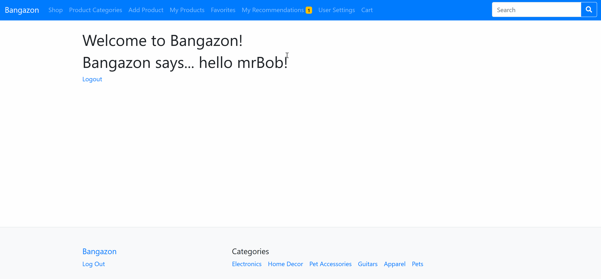
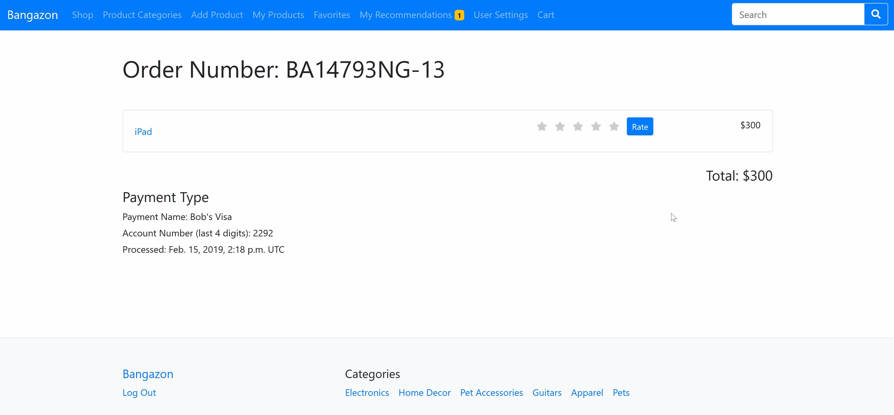
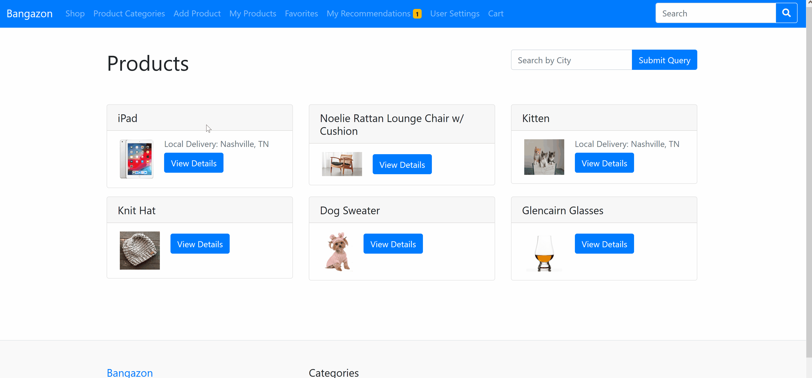
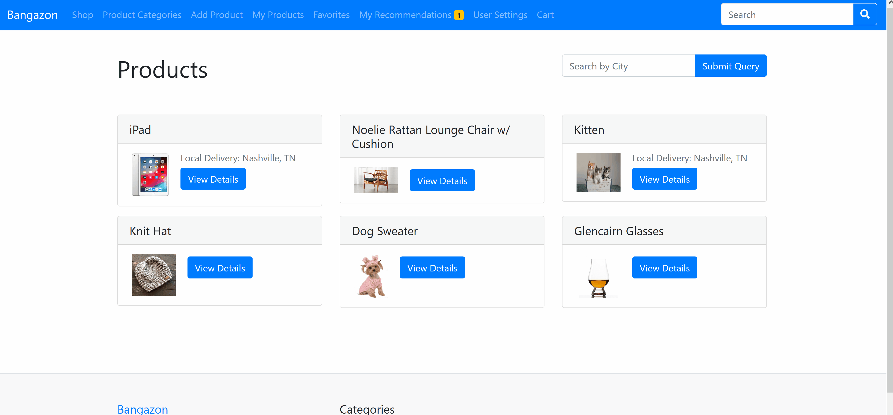
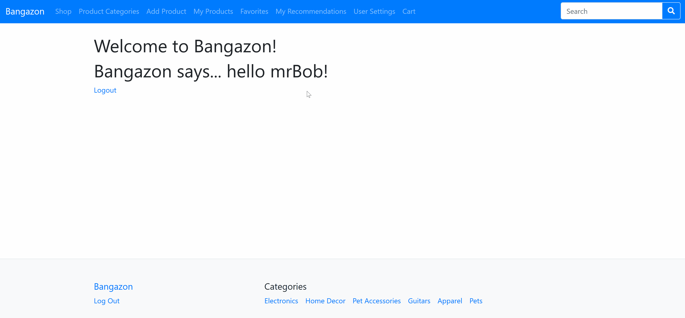

# Welcome to Bangazon

This web application is the source code for the Bangazon e-commerce web site. It is powered by Python and Django.

## Installation
- Create an empty directory to house your new project
- run `virtualenv env` to create a virtual environment within that directory
- run `source env/bin/activate` to initialize a virtual environment (`deactivate` to exit environment)
- run `git clone [repository id]`
- run `cd bangazon-workflow`
- run `pip install -r requirements.txt`

## Seed a Starter Database
- Run `python manage.py makemigrations website`
- Run `python manage.py migrate`
- If you want some data to play with, run `python manage.py loaddata db.json`
- Initialize the project using the command line by typing `python manage.py runserver` in the main directory.
- Access the application in a browser at `http://localhost:8000`.

## Products
- From the homepage, if you select <em>Shop</em> you will be taken to a list of all products
- If you select <em>View Details</em> on any product listing, you will then be taken to a view of all product details and be given the option to add the product to your cart.
- If you add a product to your cart and are logged in, you will be redirected to the view all products page with a success message to confirm that the product was added to your cart
- If you try to add a product to your cart and are not currently logged in, you will be redirected to the login page with a message encouraging you to login to proceed
- If you select <em>Product Categories</em> from the navbar, you will be taken to a list of product categories, the number of products in each category and a list of up to three of the products that are currently available for that category
- Clicking <em>Favorite this seller</em> will add the vendor to the favorites tab in the navbar.
- An already-favorited seller can be removed from the favorites tab by clicking <em>Unfavorite this seller</em>

## Product Ratings
- After a customer has completed an order, they are able to rate the products they purchased through their order history views.
- Sellers can see all of their product ratings in their "My Products" view.
- Shoppers can see product ratings on product detail pages.

## Search
- From the navbar, users can search for products by title.
- Some items are available for local delivery, and users can search by city from the products page to see what is available.

## Sell a Product
- When a user is logged in, there is an affordance in the navbar to Add a Product.
- User can add the details for their product and add it to the market place.

## Cart and Checkout
- When a user is logged in, there is an affordance in the navbar to view the Cart
- Items added from the product detail section are visible in a list.
- Individual items can be deleted instantly by clicking <em>Delete</em>
- The order can be cancelled completely (with a second confirmation screen) by clicking <em>Cancel Order</em>
- Clicking <em>Complete Order</em> will prompt the user to select a payment type
- Clicking <em>Done</em> after selecting a payment type will complete the order, thus clearing the cart of products

## User Settings
- When a user is logged in, there is an affordance in the navbar to access User Settings.
- From the User Settings page, the user can view their personal information, Payment Types and Order History.
- The user can select the edit affordance which will direct the user to form to update their information and save the changes.

## Order History
- From the User Settings Page, a user can view their past orders.
- If a use clicks on a past order they are taken to a page to view the details of that specific order.

## Payment Types
- From the User Settings page, Users can add payment types to their account so they can complete their order.
- Users can also delete payment types they no longer want to use at Bangazon.

## My Products
- When a user is logged in, there is an affordance in the navbar to see My Products. This view displays all products a user has added for sale.
- The items in My Products show how many of that product have been sold and how many are remaining, as well as how purchasing users have rated the product.
- If there are still items remaining to be sold, the user will have the option to delete the item
- The titles of all list items link back to the product's detail page

## Favorites
- Favorited vendors are shown in the favorites tab, in addition to all of their available products.
- Clicking a product will direct the user to the product detail page for that specific item.
- A vendor can be removed from the favorites page by clicking <em>Unfavorite this seller</em> on any of that vendor's product detail pages.

## Recommendations
- When a user is logged in, they have the ability to recommend a product to another user from that product's detail page
- The user must enter a correct username for recommendation, and can enter a comment to go with the recommendation if they so choose
- If a user has had something recommended to them, the My Recommendations item in the navbar will have a notification indicating how many items have been recommended.
- On the My Recommendations page, the user can see the product(s) recommended, a message if there was one entered, and can remove a recommendation if they wish. The product's title links back to the product detail page

## Viewing all products, searching the products and searching by local delivery city.

## Viewing and editing User Settings, adding and deleteing a payment type, and viewing completed orders.

## Rating a product a user has previously purchased.

## Favoriting and unfavoriting a seller.

## Recommending products to another user.

## Adding a product for sale.

## Product Categories

